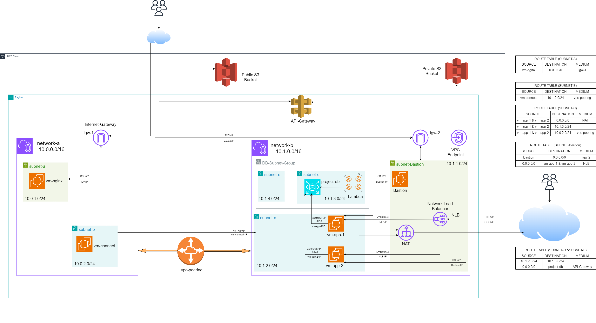

# AWS Infrastructure Overview

## Requirements

| Name | Version |
|------|---------|
|  [aws](#requirement\_aws) | 5.70.0 |

## Providers

| Name | Version |
|------|---------|
|  [aws](#provider\_aws) | 5.70.0 |
|  [http](#provider\_http) | n/a |
|  [terraform](#provider\_terraform) | n/a |

## Modules

| Name | Source | Version |
|------|--------|---------|
|  [app](#module\_app) | ../../tf-infra-modules/compute/ec2 | n/a |
|  [bastion](#module\_bastion) | ../../tf-infra-modules/compute/ec2 | n/a |
|  [vm\_connect](#module\_vm\_connect) | ../../tf-infra-modules/compute/ec2 | n/a |
|  [vm\_nginx](#module\_vm\_nginx) | ../../tf-infra-modules/compute/ec2 | n/a |

## Resources

| Name | Type |
|------|------|
| [aws_ami.amzlinux](https://registry.terraform.io/providers/hashicorp/aws/5.70.0/docs/data-sources/ami) | data source |
| [http_http.my_ip](https://registry.terraform.io/providers/hashicorp/http/latest/docs/data-sources/http) | data source |
| [terraform_remote_state.vpc](https://registry.terraform.io/providers/hashicorp/terraform/latest/docs/data-sources/remote_state) | data source |

## Inputs

| Name | Description | Type | Default | Required |
|------|-------------|------|---------|:--------:|
|  [app](#input\_app) | Defining vm\_app\_1 and vm\_app\_2 | <pre>map(object({     tags               = map(string)     key_name           = string     enable_remote_exec = bool   }))</pre> | <pre>{   "vm_app_1": {     "enable_remote_exec": false,     "key_name": "vm_app_1",     "tags": {       "Deployment_mode": "Terraform",       "Name": "vm_app_1"     }   },   "vm_app_2": {     "enable_remote_exec": false,     "key_name": "vm_app_2",     "tags": {       "Deployment_mode": "Terraform",       "Name": "vm_app_2"     }   } }</pre> | no |

## Outputs

| Name | Description |
|------|-------------|
|  [bastion\_instance\_id](#output\_bastion\_instance\_id) | Instance Id of Bastion |
|  [bastion\_instance\_private\_ip](#output\_bastion\_instance\_private\_ip) | Instance Private IP of Bastion |
|  [bastion\_instance\_public\_ip](#output\_bastion\_instance\_public\_ip) | Instance Public IP of Bastion |
|  [bastion\_key](#output\_bastion\_key) | Instance Key of Bastion |
|  [connect\_instance\_id](#output\_connect\_instance\_id) | Instance Id of vm-connect |
|  [connect\_instance\_private\_ip](#output\_connect\_instance\_private\_ip) | Instance Private IP of vm-connect |
|  [connect\_instance\_public\_ip](#output\_connect\_instance\_public\_ip) | Instance Public IP of vm-connect |
|  [connect\_key](#output\_connect\_key) | Instance Key of vm-connect |
|  [nginx\_instance\_id](#output\_nginx\_instance\_id) | Instance Id of vm-nginx |
|  [nginx\_instance\_private\_ip](#output\_nginx\_instance\_private\_ip) | Instance Private IP of vm-nginx |
|  [nginx\_instance\_public\_ip](#output\_nginx\_instance\_public\_ip) | Instance Public IP of vm-nginx |
|  [nginx\_key](#output\_nginx\_key) | Instance Key of vm-nginx |
|  [vm\_app\_1\_instance\_id](#output\_vm\_app\_1\_instance\_id) | Instance Id of vm-app-1 |
|  [vm\_app\_1\_instance\_private\_ip](#output\_vm\_app\_1\_instance\_private\_ip) | Instance Private IP of vm-app-1 |
|  [vm\_app\_1\_instance\_public\_ip](#output\_vm\_app\_1\_instance\_public\_ip) | Instance Public IP of vm-app-1 |
|  [vm\_app\_1\_key](#output\_vm\_app\_1\_key) | Instance Key of vm-app-1 |
|  [vm\_app\_2\_instance\_id](#output\_vm\_app\_2\_instance\_id) | Instance Id of vm-app-2 |
|  [vm\_app\_2\_instance\_private\_ip](#output\_vm\_app\_2\_instance\_private\_ip) | Instance Private IP of vm-app-2 |
|  [vm\_app\_2\_instance\_public\_ip](#output\_vm\_app\_2\_instance\_public\_ip) | Instance Public IP of vm-app-2 |
|  [vm\_app\_2\_key](#output\_vm\_app\_2\_key) | Instance Key of vm-app-2 |

## Requirements

| Name | Version |
|------|---------|
|  [aws](#requirement\_aws) | 5.70.0 |

## Providers

| Name | Version |
|------|---------|
|  [terraform](#provider\_terraform) | n/a |

## Modules

| Name | Source | Version |
|------|--------|---------|
|  [nlb](#module\_nlb) | ../../../tf-infra-modules/compute/load_balancer | n/a |

## Resources

| Name | Type |
|------|------|
| [terraform_remote_state.ec2](https://registry.terraform.io/providers/hashicorp/terraform/latest/docs/data-sources/remote_state) | data source |
| [terraform_remote_state.vpc](https://registry.terraform.io/providers/hashicorp/terraform/latest/docs/data-sources/remote_state) | data source |

## Inputs

No inputs.

## Outputs

| Name | Description |
|------|-------------|
|  [nlb\_dns\_name](#output\_nlb\_dns\_name) | Load Balncer DNS Name |

## Requirements

| Name | Version |
|------|---------|
|  [aws](#requirement\_aws) | 5.70.0 |

## Providers

| Name | Version |
|------|---------|
|  [terraform](#provider\_terraform) | n/a |

## Modules

| Name | Source | Version |
|------|--------|---------|
|  [project\_db](#module\_project\_db) | ../../tf-infra-modules/database | n/a |

## Resources

| Name | Type |
|------|------|
| [terraform_remote_state.ec2](https://registry.terraform.io/providers/hashicorp/terraform/latest/docs/data-sources/remote_state) | data source |
| [terraform_remote_state.lambda](https://registry.terraform.io/providers/hashicorp/terraform/latest/docs/data-sources/remote_state) | data source |
| [terraform_remote_state.vpc](https://registry.terraform.io/providers/hashicorp/terraform/latest/docs/data-sources/remote_state) | data source |

## Inputs

No inputs.

## Outputs

| Name | Description |
|------|-------------|
|  [db\_address](#output\_db\_address) | Database Address |
|  [db\_name](#output\_db\_name) | Database Name |
|  [db\_password](#output\_db\_password) | Database Password |
|  [db\_port](#output\_db\_port) | Database Port |
|  [db\_security\_group\_id](#output\_db\_security\_group\_id) | Database Security Group Id |
|  [db\_username](#output\_db\_username) | Database Username |

## Requirements

| Name | Version |
|------|---------|
|  [aws](#requirement\_aws) | 5.70.0 |

## Providers

No providers.

## Modules

| Name | Source | Version |
|------|--------|---------|
|  [database\_route\_table\_network\_b](#module\_database\_route\_table\_network\_b) | ../../tf-infra-modules/network/route-table/public-route-table | n/a |
|  [network\_a\_gateway](#module\_network\_a\_gateway) | ../../tf-infra-modules/network/gateway | n/a |
|  [network\_a\_private\_route\_table](#module\_network\_a\_private\_route\_table) | ../../tf-infra-modules/network/route-table/private-route-table | n/a |
|  [network\_a\_public\_route\_table](#module\_network\_a\_public\_route\_table) | ../../tf-infra-modules/network/route-table/public-route-table | n/a |
|  [network\_a\_subnet](#module\_network\_a\_subnet) | ../../tf-infra-modules/network/subnet | n/a |
|  [network\_b\_gateway](#module\_network\_b\_gateway) | ../../tf-infra-modules/network/gateway | n/a |
|  [network\_b\_private\_route\_table](#module\_network\_b\_private\_route\_table) | ../../tf-infra-modules/network/route-table/private-route-table | n/a |
|  [network\_b\_public\_route\_table](#module\_network\_b\_public\_route\_table) | ../../tf-infra-modules/network/route-table/public-route-table | n/a |
|  [network\_b\_subnet](#module\_network\_b\_subnet) | ../../tf-infra-modules/network/subnet | n/a |
|  [vpc\_network\_a](#module\_vpc\_network\_a) | ../../tf-infra-modules/network/vpc | n/a |
|  [vpc\_network\_b](#module\_vpc\_network\_b) | ../../tf-infra-modules/network/vpc | n/a |
|  [vpc\_peering](#module\_vpc\_peering) | ../../tf-infra-modules/network/peering | n/a |

## Resources

No resources.

## Inputs

| Name | Description | Type | Default | Required |
|------|-------------|------|---------|:--------:|
|  [subnet\_network\_a](#input\_subnet\_network\_a) | subnet defining for network\_a | <pre>map(object({     cidr_block              = string     availability_zone       = string     map_public_ip_on_launch = bool     subnet_name             = string     tags                    = map(string)   }))</pre> | <pre>{   "subnet_a": {     "availability_zone": "us-east-1a",     "cidr_block": "10.0.1.0/24",     "map_public_ip_on_launch": true,     "subnet_name": "subnet_a",     "tags": {       "Deployment_mode": "Terraform",       "Name": "subnet_a"     }   },   "subnet_b": {     "availability_zone": "us-east-1b",     "cidr_block": "10.0.2.0/24",     "map_public_ip_on_launch": false,     "subnet_name": "subnet_b",     "tags": {       "Deployment_mode": "Terraform",       "Name": "subnet_b"     }   } }</pre> | no |
|  [subnet\_network\_b](#input\_subnet\_network\_b) | Defining subnet for network\_b | <pre>map(object({     cidr_block              = string     availability_zone       = string     map_public_ip_on_launch = bool     subnet_name             = string     tags                    = map(string)   }))</pre> | <pre>{   "subnet_bastion": {     "availability_zone": "us-east-1a",     "cidr_block": "10.1.1.0/24",     "map_public_ip_on_launch": true,     "subnet_name": "subnet_bastion",     "tags": {       "Deployment_mode": "Terraform",       "Name": "subnet_bastion"     }   },   "subnet_c": {     "availability_zone": "us-east-1b",     "cidr_block": "10.1.2.0/24",     "map_public_ip_on_launch": false,     "subnet_name": "subnet_c",     "tags": {       "Deployment_mode": "Terraform",       "Name": "subnet_c"     }   },   "subnet_d": {     "availability_zone": "us-east-1c",     "cidr_block": "10.1.3.0/24",     "map_public_ip_on_launch": false,     "subnet_name": "subnet_d",     "tags": {       "Deployment_mode": "Terraform",       "Name": "subnet_d"     }   },   "subnet_e": {     "availability_zone": "us-east-1d",     "cidr_block": "10.1.4.0/24",     "map_public_ip_on_launch": false,     "subnet_name": "subnet_e",     "tags": {       "Deployment_mode": "Terraform",       "Name": "subnet_e"     }   } }</pre> | no |

## Outputs

| Name | Description |
|------|-------------|
|  [network\_a\_internet\_gateway](#output\_network\_a\_internet\_gateway) | Internet gateway id of network\_a |
|  [network\_a\_private\_cidr\_blocks](#output\_network\_a\_private\_cidr\_blocks) | private subnet CIDR block of network\_a |
|  [network\_a\_private\_route\_table](#output\_network\_a\_private\_route\_table) | private route table id of network\_a |
|  [network\_a\_private\_subnet\_ids](#output\_network\_a\_private\_subnet\_ids) | private subnet id of network\_a |
|  [network\_a\_private\_table\_association](#output\_network\_a\_private\_table\_association) | private route table association of network\_a |
|  [network\_a\_public\_cidr\_blocks](#output\_network\_a\_public\_cidr\_blocks) | public subnet CIDR block of network\_a |
|  [network\_a\_public\_route\_association](#output\_network\_a\_public\_route\_association) | public route table association id |
|  [network\_a\_public\_route\_table](#output\_network\_a\_public\_route\_table) | public route table id of network\_a |
|  [network\_a\_public\_subnet\_ids](#output\_network\_a\_public\_subnet\_ids) | public subnet Id in network\_a |
|  [network\_b\_internet\_gateway](#output\_network\_b\_internet\_gateway) | Internet Gateway of network\_b |
|  [network\_b\_nat\_gateway](#output\_network\_b\_nat\_gateway) | NAT Gateway id of network\_b |
|  [network\_b\_private\_cidr\_blocks](#output\_network\_b\_private\_cidr\_blocks) | private subnet cidr block of network\_b |
|  [network\_b\_private\_route\_table](#output\_network\_b\_private\_route\_table) | Private route table id of network\_b |
|  [network\_b\_private\_subnet\_ids](#output\_network\_b\_private\_subnet\_ids) | private subnet id of network\_b |
|  [network\_b\_private\_table\_association](#output\_network\_b\_private\_table\_association) | private route tabla association id of network\_b |
|  [network\_b\_public\_cidr\_blocks](#output\_network\_b\_public\_cidr\_blocks) | pulic subnet cidr block of network\_b |
|  [network\_b\_public\_route\_association](#output\_network\_b\_public\_route\_association) | public route table association id of network\_b |
|  [network\_b\_public\_route\_table](#output\_network\_b\_public\_route\_table) | public route table of network\_b |
|  [network\_b\_public\_subnet\_ids](#output\_network\_b\_public\_subnet\_ids) | Public subnet id of network\_b |
|  [vpc\_cidr\_block\_network\_a](#output\_vpc\_cidr\_block\_network\_a) | VPC CIDR block of network\_a |
|  [vpc\_cidr\_block\_network\_b](#output\_vpc\_cidr\_block\_network\_b) | VPC CIDR block of network\_b |
|  [vpc\_id\_network\_a](#output\_vpc\_id\_network\_a) | VPC Id for network\_a |
|  [vpc\_id\_network\_b](#output\_vpc\_id\_network\_b) | VPC id of network\_b |
|  [vpc\_peering\_connection\_id](#output\_vpc\_peering\_connection\_id) | vpc peering connection id |

## Requirements

| Name | Version |
|------|---------|
|  [aws](#requirement\_aws) | 5.70.0 |

## Providers

| Name | Version |
|------|---------|
|  [terraform](#provider\_terraform) | n/a |

## Modules

| Name | Source | Version |
|------|--------|---------|
|  [api\_gateway](#module\_api\_gateway) | ../../tf-infra-modules/serverless/api-gateway | n/a |
|  [delete\_students](#module\_delete\_students) | ../../tf-infra-modules/serverless/lambda | n/a |
|  [get\_students](#module\_get\_students) | ../../tf-infra-modules/serverless/lambda | n/a |
|  [iam\_role](#module\_iam\_role) | ../../tf-infra-modules/serverless/iam-role | n/a |
|  [post\_students](#module\_post\_students) | ../../tf-infra-modules/serverless/lambda | n/a |
|  [put\_students](#module\_put\_students) | ../../tf-infra-modules/serverless/lambda | n/a |

## Resources

| Name | Type |
|------|------|
| [terraform_remote_state.rds](https://registry.terraform.io/providers/hashicorp/terraform/latest/docs/data-sources/remote_state) | data source |
| [terraform_remote_state.vpc](https://registry.terraform.io/providers/hashicorp/terraform/latest/docs/data-sources/remote_state) | data source |

## Inputs

No inputs.

## Outputs

| Name | Description |
|------|-------------|
|  [invoke\_url](#output\_invoke\_url) | Invoke URL for Public Accessing the Lambda functions |
|  [lambda\_security\_group](#output\_lambda\_security\_group) | The security Group for Connecting Database |

## Requirements

| Name | Version |
|------|---------|
|  [aws](#requirement\_aws) | 5.70.0 |

## Providers

| Name | Version |
|------|---------|
|  [terraform](#provider\_terraform) | n/a |

## Modules

| Name | Source | Version |
|------|--------|---------|
|  [s3\_bucket](#module\_s3\_bucket) | ../../tf-infra-modules/storage | n/a |

## Resources

| Name | Type |
|------|------|
| [terraform_remote_state.vpc](https://registry.terraform.io/providers/hashicorp/terraform/latest/docs/data-sources/remote_state) | data source |

## Inputs

No inputs.

## Outputs

| Name | Description |
|------|-------------|
|  [private\_s3\_bucket\_name](#output\_private\_s3\_bucket\_name) | Private s3 bucket Name |
|  [public\_s3\_bucket\_name](#output\_public\_s3\_bucket\_name) | Public s3 bucket Name |
|  [s3\_vpc\_endpoint\_id](#output\_s3\_vpc\_endpoint\_id) | VPC Endpoint for Private Connection |

## Requirements

No requirements.

## Providers

| Name | Version |
|------|---------|
|  [aws](#provider\_aws) | n/a |
|  [null](#provider\_null) | n/a |
|  [tls](#provider\_tls) | n/a |

## Modules

No modules.

## Resources

| Name | Type |
|------|------|
| [aws_iam_instance_profile.ec2_instance_profile](https://registry.terraform.io/providers/hashicorp/aws/latest/docs/resources/iam_instance_profile) | resource |
| [aws_iam_role.ec2_exec](https://registry.terraform.io/providers/hashicorp/aws/latest/docs/resources/iam_role) | resource |
| [aws_iam_role_policy_attachment.secrets_manager_rw_policy](https://registry.terraform.io/providers/hashicorp/aws/latest/docs/resources/iam_role_policy_attachment) | resource |
| [aws_instance.ec2](https://registry.terraform.io/providers/hashicorp/aws/latest/docs/resources/instance) | resource |
| [aws_key_pair.ec2_key](https://registry.terraform.io/providers/hashicorp/aws/latest/docs/resources/key_pair) | resource |
| [aws_security_group.ec2_sg](https://registry.terraform.io/providers/hashicorp/aws/latest/docs/resources/security_group) | resource |
| [null_resource.file_provision](https://registry.terraform.io/providers/hashicorp/null/latest/docs/resources/resource) | resource |
| [null_resource.local_exec](https://registry.terraform.io/providers/hashicorp/null/latest/docs/resources/resource) | resource |
| [null_resource.remote_exec](https://registry.terraform.io/providers/hashicorp/null/latest/docs/resources/resource) | resource |
| [tls_private_key.key](https://registry.terraform.io/providers/hashicorp/tls/latest/docs/resources/private_key) | resource |

## Inputs

| Name | Description | Type | Default | Required |
|------|-------------|------|---------|:--------:|
|  [ami\_id](#input\_ami\_id) | AMI Id | `string` | n/a | yes |
|  [app\_peer\_cidr](#input\_app\_peer\_cidr) | App Peer CIDR | `string` | `""` | no |
|  [associate\_public\_ip\_address](#input\_associate\_public\_ip\_address) | Associate public ip address | `bool` | n/a | yes |
|  [bastion\_host](#input\_bastion\_host) | Bastion Host | `string` | `""` | no |
|  [bastion\_key\_content](#input\_bastion\_key\_content) | Bastion Key Content | `string` | `""` | no |
|  [create\_ec2\_role](#input\_create\_ec2\_role) | Create EC2 Role | `bool` | n/a | yes |
|  [create\_sg](#input\_create\_sg) | Create security group | `bool` | n/a | yes |
|  [enable\_app\_http](#input\_enable\_app\_http) | Enable App HTTP | `bool` | `false` | no |
|  [enable\_app\_listen\_port](#input\_enable\_app\_listen\_port) | Enable App Listen Port | `bool` | `false` | no |
|  [enable\_bastion\_ssh](#input\_enable\_bastion\_ssh) | Enable bastion SSH | `bool` | `false` | no |
|  [enable\_default\_egress](#input\_enable\_default\_egress) | Enable Default Egress | `bool` | `false` | no |
|  [enable\_file\_provisioner](#input\_enable\_file\_provisioner) | Enable file provisioner | `bool` | `false` | no |
|  [enable\_local\_exec](#input\_enable\_local\_exec) | Enable Local Exec | `bool` | `false` | no |
|  [enable\_nginx\_http](#input\_enable\_nginx\_http) | Enable Nginx HTTP | `bool` | `false` | no |
|  [enable\_remote\_exec](#input\_enable\_remote\_exec) | Enable Remote Exec | `bool` | `false` | no |
|  [enable\_ssh](#input\_enable\_ssh) | Enable SSH | `bool` | `false` | no |
|  [enable\_user\_data](#input\_enable\_user\_data) | Enable User data | `bool` | `false` | no |
|  [enable\_vpc\_peering\_sg](#input\_enable\_vpc\_peering\_sg) | Enable VPC Peering Security Group | `bool` | `false` | no |
|  [file\_destination](#input\_file\_destination) | File Destination | `string` | `""` | no |
|  [instance\_type](#input\_instance\_type) | Instance Type | `string` | n/a | yes |
|  [key\_name](#input\_key\_name) | Key\_Name | `string` | n/a | yes |
|  [local\_exec\_commands](#input\_local\_exec\_commands) | Local Exec Commands | `list(string)` | `[]` | no |
|  [remote\_exec\_commands](#input\_remote\_exec\_commands) | Remote Exec | `list(string)` | `[]` | no |
|  [sg\_ssh\_cidr](#input\_sg\_ssh\_cidr) | Security Group CIDR | `string` | `""` | no |
|  [source\_file](#input\_source\_file) | source file | `string` | `""` | no |
|  [subnet\_id](#input\_subnet\_id) | Subnet Id | `string` | n/a | yes |
|  [tags](#input\_tags) | Maintain By Terraform | `map(string)` | n/a | yes |
|  [use\_public\_ip](#input\_use\_public\_ip) | Use Public IP | `bool` | `true` | no |
|  [user\_data](#input\_user\_data) | user data | `string` | n/a | yes |
|  [user\_ip](#input\_user\_ip) | User Ip from Data block | `string` | `""` | no |
|  [vpc\_id](#input\_vpc\_id) | VPC Id | `any` | n/a | yes |

## Outputs

| Name | Description |
|------|-------------|
|  [ec2\_id](#output\_ec2\_id) | Instance ID |
|  [private\_ip](#output\_private\_ip) | Instance Private IP |
|  [public\_ip](#output\_public\_ip) | Instance Public IP |
|  [role\_name](#output\_role\_name) | Instance Role |
|  [vm\_key](#output\_vm\_key) | Instance Key |

## Requirements

No requirements.

## Providers

| Name | Version |
|------|---------|
|  [aws](#provider\_aws) | n/a |

## Modules

No modules.

## Resources

| Name | Type |
|------|------|
| [aws_lb.nlb](https://registry.terraform.io/providers/hashicorp/aws/latest/docs/resources/lb) | resource |
| [aws_lb_listener.tcp_listener](https://registry.terraform.io/providers/hashicorp/aws/latest/docs/resources/lb_listener) | resource |
| [aws_lb_target_group.app_tg](https://registry.terraform.io/providers/hashicorp/aws/latest/docs/resources/lb_target_group) | resource |
| [aws_lb_target_group_attachment.app_tg_attachment_vm_app](https://registry.terraform.io/providers/hashicorp/aws/latest/docs/resources/lb_target_group_attachment) | resource |

## Inputs

| Name | Description | Type | Default | Required |
|------|-------------|------|---------|:--------:|
|  [enable\_cross\_zone\_load\_balancing](#input\_enable\_cross\_zone\_load\_balancing) | Enable cross zone load balancing | `bool` | n/a | yes |
|  [enable\_deletion\_protection](#input\_enable\_deletion\_protection) | Enable deletion protection | `bool` | `false` | no |
|  [internal](#input\_internal) | Internal or External | `bool` | `false` | no |
|  [listener\_port](#input\_listener\_port) | Listener Port | `number` | n/a | yes |
|  [load\_balancer\_type](#input\_load\_balancer\_type) | Load balancer Type | `string` | n/a | yes |
|  [nlb\_name](#input\_nlb\_name) | Load Balancer name | `string` | n/a | yes |
|  [subnet\_ids](#input\_subnet\_ids) | subnet Ids | `list(string)` | n/a | yes |
|  [target\_group\_name](#input\_target\_group\_name) | Target group Name | `string` | n/a | yes |
|  [target\_group\_port](#input\_target\_group\_port) | Target Group Port | `number` | n/a | yes |
|  [target\_ids](#input\_target\_ids) | Target Ids | `list(string)` | n/a | yes |
|  [vpc\_id](#input\_vpc\_id) | VPC Id | `string` | n/a | yes |

## Outputs

| Name | Description |
|------|-------------|
|  [nlb\_dns\_name](#output\_nlb\_dns\_name) | Load Balancer DNS |

## Requirements

No requirements.

## Providers

| Name | Version |
|------|---------|
|  [aws](#provider\_aws) | n/a |
|  [random](#provider\_random) | n/a |

## Modules

No modules.

## Resources

| Name | Type |
|------|------|
| [aws_db_instance.db](https://registry.terraform.io/providers/hashicorp/aws/latest/docs/resources/db_instance) | resource |
| [aws_db_subnet_group.subnet_group](https://registry.terraform.io/providers/hashicorp/aws/latest/docs/resources/db_subnet_group) | resource |
| [aws_secretsmanager_secret.db_credentials](https://registry.terraform.io/providers/hashicorp/aws/latest/docs/resources/secretsmanager_secret) | resource |
| [aws_secretsmanager_secret_version.db_credentials_version](https://registry.terraform.io/providers/hashicorp/aws/latest/docs/resources/secretsmanager_secret_version) | resource |
| [aws_security_group.db_sg](https://registry.terraform.io/providers/hashicorp/aws/latest/docs/resources/security_group) | resource |
| [random_password.db_password](https://registry.terraform.io/providers/hashicorp/random/latest/docs/resources/password) | resource |

## Inputs

| Name | Description | Type | Default | Required |
|------|-------------|------|---------|:--------:|
|  [allocated\_storage](#input\_allocated\_storage) | allocated storage | `number` | n/a | yes |
|  [create\_sg](#input\_create\_sg) | create security group | `bool` | `false` | no |
|  [db\_name](#input\_db\_name) | database Name | `string` | n/a | yes |
|  [enable\_db\_access\_app\_1](#input\_enable\_db\_access\_app\_1) | Vm-app-1 | `bool` | n/a | yes |
|  [enable\_db\_access\_app\_2](#input\_enable\_db\_access\_app\_2) | Enable for vm-app-2 | `bool` | n/a | yes |
|  [enable\_lambda\_sg](#input\_enable\_lambda\_sg) | Lambda security Group | `bool` | n/a | yes |
|  [engine](#input\_engine) | database engine | `string` | n/a | yes |
|  [engine\_version](#input\_engine\_version) | database engine version | `string` | n/a | yes |
|  [identifier](#input\_identifier) | Indentifier | `string` | n/a | yes |
|  [instance\_class](#input\_instance\_class) | database Instance Class | `string` | n/a | yes |
|  [lambda\_security\_group](#input\_lambda\_security\_group) | lambda security Group Id | `string` | `""` | no |
|  [password\_length](#input\_password\_length) | database Password Length | `number` | n/a | yes |
|  [publicly\_accessible](#input\_publicly\_accessible) | Publicly Accessible | `bool` | n/a | yes |
|  [secret\_db\_name](#input\_secret\_db\_name) | DB Credentials | `any` | n/a | yes |
|  [secret\_recovery\_days](#input\_secret\_recovery\_days) | secret recovery days | `number` | n/a | yes |
|  [skip\_final\_snapshot](#input\_skip\_final\_snapshot) | Skip final snapshot | `bool` | n/a | yes |
|  [subnet\_group\_name](#input\_subnet\_group\_name) | subnet group name | `string` | n/a | yes |
|  [subnet\_ids](#input\_subnet\_ids) | subnet Ids | `list(string)` | n/a | yes |
|  [username](#input\_username) | database username | `string` | n/a | yes |
|  [vm\_app\_1\_private\_ip](#input\_vm\_app\_1\_private\_ip) | vm-app-1-private-IP | `any` | n/a | yes |
|  [vm\_app\_2\_private\_ip](#input\_vm\_app\_2\_private\_ip) | Vm-app-2-private-IP | `any` | n/a | yes |
|  [vpc\_id](#input\_vpc\_id) | VPC Id | `any` | n/a | yes |

## Outputs

| Name | Description |
|------|-------------|
|  [db\_address](#output\_db\_address) | Database Address |
|  [db\_endpoint](#output\_db\_endpoint) | Database Endpoint |
|  [db\_name](#output\_db\_name) | Database Name |
|  [db\_password](#output\_db\_password) | Database Password |
|  [db\_port](#output\_db\_port) | Database Port |
|  [db\_security\_group](#output\_db\_security\_group) | Database Security Group |
|  [db\_username](#output\_db\_username) | Database Username |

## Requirements

No requirements.

## Providers

| Name | Version |
|------|---------|
|  [aws](#provider\_aws) | n/a |

## Modules

No modules.

## Resources

| Name | Type |
|------|------|
| [aws_eip.nat_eip](https://registry.terraform.io/providers/hashicorp/aws/latest/docs/resources/eip) | resource |
| [aws_internet_gateway.public_igw](https://registry.terraform.io/providers/hashicorp/aws/latest/docs/resources/internet_gateway) | resource |
| [aws_nat_gateway.nat_gateway](https://registry.terraform.io/providers/hashicorp/aws/latest/docs/resources/nat_gateway) | resource |

## Inputs

| Name | Description | Type | Default | Required |
|------|-------------|------|---------|:--------:|
|  [create\_igw](#input\_create\_igw) | IGW description | `bool` | `true` | no |
|  [create\_nat\_eip](#input\_create\_nat\_eip) | Create NAT | `bool` | `false` | no |
|  [create\_nat\_gateway](#input\_create\_nat\_gateway) | Create NAT Gateway | `bool` | `true` | no |
|  [nat\_gateway\_subnet\_name](#input\_nat\_gateway\_subnet\_name) | NAT Gateway subnet Name | `any` | n/a | yes |
|  [network\_name](#input\_network\_name) | Network Name | `any` | n/a | yes |
|  [tags](#input\_tags) | Maintain By terraform | `map(string)` | n/a | yes |
|  [vpc\_id](#input\_vpc\_id) | VPC Id | `any` | n/a | yes |

## Outputs

| Name | Description |
|------|-------------|
|  [internet\_gateway\_id](#output\_internet\_gateway\_id) | Internet gateway ID |
|  [nat\_gateway\_id](#output\_nat\_gateway\_id) | NAT Gateway ID |

## Requirements

No requirements.

## Providers

| Name | Version |
|------|---------|
|  [aws](#provider\_aws) | n/a |

## Modules

No modules.

## Resources

| Name | Type |
|------|------|
| [aws_route.peer_route_network](https://registry.terraform.io/providers/hashicorp/aws/latest/docs/resources/route) | resource |
| [aws_vpc_peering_connection.peer](https://registry.terraform.io/providers/hashicorp/aws/latest/docs/resources/vpc_peering_connection) | resource |

## Inputs

| Name | Description | Type | Default | Required |
|------|-------------|------|---------|:--------:|
|  [auto\_accept](#input\_auto\_accept) | Auto Accept | `bool` | `false` | no |
|  [destination\_cidr\_block](#input\_destination\_cidr\_block) | Destination CIDR Block | `map(string)` | n/a | yes |
|  [peer\_vpc\_id](#input\_peer\_vpc\_id) | Peer VPC Id | `any` | n/a | yes |
|  [route\_table\_id](#input\_route\_table\_id) | Route Table Id | `map(string)` | n/a | yes |
|  [vpc\_id](#input\_vpc\_id) | VPC Id | `any` | n/a | yes |

## Outputs

| Name | Description |
|------|-------------|
|  [vpc\_peering\_connection\_id](#output\_vpc\_peering\_connection\_id) | Peering Connection Id |

## Requirements

No requirements.

## Providers

| Name | Version |
|------|---------|
|  [aws](#provider\_aws) | n/a |

## Modules

No modules.

## Resources

| Name | Type |
|------|------|
| [aws_route.private_route](https://registry.terraform.io/providers/hashicorp/aws/latest/docs/resources/route) | resource |
| [aws_route_table.private_route_table](https://registry.terraform.io/providers/hashicorp/aws/latest/docs/resources/route_table) | resource |
| [aws_route_table_association.private_association](https://registry.terraform.io/providers/hashicorp/aws/latest/docs/resources/route_table_association) | resource |

## Inputs

| Name | Description | Type | Default | Required |
|------|-------------|------|---------|:--------:|
|  [associate\_private\_subnets](#input\_associate\_private\_subnets) | associate private subnets | `bool` | `true` | no |
|  [create\_private\_route](#input\_create\_private\_route) | Create private route | `bool` | `true` | no |
|  [create\_private\_route\_table](#input\_create\_private\_route\_table) | Create private route Table | `bool` | `true` | no |
|  [create\_private\_subnet\_association](#input\_create\_private\_subnet\_association) | create private subnet association | `bool` | n/a | yes |
|  [nat\_gateway\_id](#input\_nat\_gateway\_id) | NAT gateway Id | `string` | `""` | no |
|  [network\_name](#input\_network\_name) | Network Name | `any` | n/a | yes |
|  [subnet\_ids](#input\_subnet\_ids) | Subnet Id | `list(string)` | n/a | yes |
|  [tags](#input\_tags) | Maintain By Terraform | `map(string)` | n/a | yes |
|  [vpc\_id](#input\_vpc\_id) | VPC Id | `any` | n/a | yes |

## Outputs

| Name | Description |
|------|-------------|
|  [private\_route\_table\_association\_ids](#output\_private\_route\_table\_association\_ids) | Private Route Table Association Id |
|  [private\_route\_table\_id](#output\_private\_route\_table\_id) | Private Route Table |
|  [private\_subnet\_ids](#output\_private\_subnet\_ids) | Private Subnet Ids |

## Requirements

No requirements.

## Providers

| Name | Version |
|------|---------|
|  [aws](#provider\_aws) | n/a |

## Modules

No modules.

## Resources

| Name | Type |
|------|------|
| [aws_route.public_route](https://registry.terraform.io/providers/hashicorp/aws/latest/docs/resources/route) | resource |
| [aws_route_table.public_route_table](https://registry.terraform.io/providers/hashicorp/aws/latest/docs/resources/route_table) | resource |
| [aws_route_table_association.public_association](https://registry.terraform.io/providers/hashicorp/aws/latest/docs/resources/route_table_association) | resource |

## Inputs

| Name | Description | Type | Default | Required |
|------|-------------|------|---------|:--------:|
|  [associate\_public\_subnets](#input\_associate\_public\_subnets) | associate public subnets | `bool` | `true` | no |
|  [create\_public\_route](#input\_create\_public\_route) | Create Public Route | `bool` | `true` | no |
|  [create\_public\_route\_table](#input\_create\_public\_route\_table) | Whether To Create public route table | `bool` | `true` | no |
|  [create\_public\_subnet\_association](#input\_create\_public\_subnet\_association) | Create Public subnet association | `bool` | n/a | yes |
|  [igw\_gateway\_id](#input\_igw\_gateway\_id) | Internet Gateway Id | `any` | n/a | yes |
|  [subnet\_ids](#input\_subnet\_ids) | Subnet Id | `list(string)` | n/a | yes |
|  [table\_name](#input\_table\_name) | Table Name | `any` | n/a | yes |
|  [tags](#input\_tags) | Maintain by Terraform | `map(string)` | n/a | yes |
|  [vpc\_id](#input\_vpc\_id) | VPC Id | `any` | n/a | yes |

## Outputs

| Name | Description |
|------|-------------|
|  [public\_route\_table\_association\_ids](#output\_public\_route\_table\_association\_ids) | Public Route Table Association ID |
|  [public\_route\_table\_id](#output\_public\_route\_table\_id) | Public Route Table ID |

## Requirements

No requirements.

## Providers

| Name | Version |
|------|---------|
|  [aws](#provider\_aws) | n/a |

## Modules

No modules.

## Resources

| Name | Type |
|------|------|
| [aws_subnet.subnet](https://registry.terraform.io/providers/hashicorp/aws/latest/docs/resources/subnet) | resource |

## Inputs

| Name | Description | Type | Default | Required |
|------|-------------|------|---------|:--------:|
|  [availability\_zone](#input\_availability\_zone) | Availability Zone | `any` | n/a | yes |
|  [cidr\_block](#input\_cidr\_block) | Cidr Block | `any` | n/a | yes |
|  [map\_public\_ip\_on\_launch](#input\_map\_public\_ip\_on\_launch) | Map Public IP on Launch information | `bool` | n/a | yes |
|  [subnet\_name](#input\_subnet\_name) | Subnet name | `any` | n/a | yes |
|  [tags](#input\_tags) | Maintained By Terraform | `map(string)` | n/a | yes |
|  [vpc\_id](#input\_vpc\_id) | VPC Id | `any` | n/a | yes |

## Outputs

| Name | Description |
|------|-------------|
|  [cidr\_block](#output\_cidr\_block) | subnet CIDR Block |
|  [subnet\_id](#output\_subnet\_id) | Subnet Id |

## Requirements

No requirements.

## Providers

| Name | Version |
|------|---------|
|  [aws](#provider\_aws) | n/a |

## Modules

No modules.

## Resources

| Name | Type |
|------|------|
| [aws_vpc.vpc_common](https://registry.terraform.io/providers/hashicorp/aws/latest/docs/resources/vpc) | resource |

## Inputs

| Name | Description | Type | Default | Required |
|------|-------------|------|---------|:--------:|
|  [tags](#input\_tags) | Tags for Terraform Deployment | `map(string)` | n/a | yes |
|  [vpc\_cidr\_block](#input\_vpc\_cidr\_block) | VPC Cidr Block | `any` | n/a | yes |

## Outputs

| Name | Description |
|------|-------------|
|  [vpc\_cidr\_block](#output\_vpc\_cidr\_block) | Vpc CIDR Block |
|  [vpc\_id](#output\_vpc\_id) | VPC Id |

## Requirements

No requirements.

## Providers

| Name | Version |
|------|---------|
|  [aws](#provider\_aws) | n/a |

## Modules

No modules.

## Resources

| Name | Type |
|------|------|
| [aws_api_gateway_resource.main_id](https://registry.terraform.io/providers/hashicorp/aws/latest/docs/resources/api_gateway_resource) | resource |
| [aws_api_gateway_resource.resource_with_id](https://registry.terraform.io/providers/hashicorp/aws/latest/docs/resources/api_gateway_resource) | resource |
| [aws_api_gateway_rest_api.api_gateway](https://registry.terraform.io/providers/hashicorp/aws/latest/docs/resources/api_gateway_rest_api) | resource |

## Inputs

| Name | Description | Type | Default | Required |
|------|-------------|------|---------|:--------:|
|  [api\_name](#input\_api\_name) | API Name | `any` | n/a | yes |
|  [main\_resource\_id](#input\_main\_resource\_id) | Main Resource Id | `any` | n/a | yes |
|  [sub\_resource\_id](#input\_sub\_resource\_id) | Sub-Resource Id | `any` | n/a | yes |

## Outputs

| Name | Description |
|------|-------------|
|  [api\_id](#output\_api\_id) | API gateway ID |
|  [execution\_arn](#output\_execution\_arn) | Execution ARN for mapping source ARN in Lambda functions |
|  [root\_resource\_id](#output\_root\_resource\_id) | Root Resource ID |
|  [student\_with\_id\_resource\_id](#output\_student\_with\_id\_resource\_id) | Student will Rollno Resource Id |
|  [students\_resource\_id](#output\_students\_resource\_id) | Student Resource Id |

## Requirements

No requirements.

## Providers

| Name | Version |
|------|---------|
|  [aws](#provider\_aws) | n/a |

## Modules

No modules.

## Resources

| Name | Type |
|------|------|
| [aws_iam_role.lambda_exec](https://registry.terraform.io/providers/hashicorp/aws/latest/docs/resources/iam_role) | resource |
| [aws_iam_role_policy_attachment.lambda_exec_policy_basic](https://registry.terraform.io/providers/hashicorp/aws/latest/docs/resources/iam_role_policy_attachment) | resource |
| [aws_iam_role_policy_attachment.lambda_exec_policy_vpc_access](https://registry.terraform.io/providers/hashicorp/aws/latest/docs/resources/iam_role_policy_attachment) | resource |
| [aws_security_group.lambda_sg](https://registry.terraform.io/providers/hashicorp/aws/latest/docs/resources/security_group) | resource |

## Inputs

| Name | Description | Type | Default | Required |
|------|-------------|------|---------|:--------:|
|  [iam\_role\_name](#input\_iam\_role\_name) | IAM Role Name | `any` | n/a | yes |
|  [rds\_security\_group](#input\_rds\_security\_group) | Security Group of Database | `any` | n/a | yes |
|  [vpc\_id](#input\_vpc\_id) | VPC Id | `any` | n/a | yes |

## Outputs

| Name | Description |
|------|-------------|
|  [lambda\_security\_group](#output\_lambda\_security\_group) | Lambda security group ID |
|  [lamda\_role\_arn](#output\_lamda\_role\_arn) | Lambda Role ARN |

## Requirements

No requirements.

## Providers

| Name | Version |
|------|---------|
|  [aws](#provider\_aws) | n/a |

## Modules

No modules.

## Resources

| Name | Type |
|------|------|
| [aws_api_gateway_deployment.api_deployment](https://registry.terraform.io/providers/hashicorp/aws/latest/docs/resources/api_gateway_deployment) | resource |
| [aws_api_gateway_integration.api_integration](https://registry.terraform.io/providers/hashicorp/aws/latest/docs/resources/api_gateway_integration) | resource |
| [aws_api_gateway_method.api_method](https://registry.terraform.io/providers/hashicorp/aws/latest/docs/resources/api_gateway_method) | resource |
| [aws_lambda_function.lambda_function](https://registry.terraform.io/providers/hashicorp/aws/latest/docs/resources/lambda_function) | resource |
| [aws_lambda_permission.lambda_permission](https://registry.terraform.io/providers/hashicorp/aws/latest/docs/resources/lambda_permission) | resource |

## Inputs

| Name | Description | Type | Default | Required |
|------|-------------|------|---------|:--------:|
|  [api\_resource\_id](#input\_api\_resource\_id) | specified API resource id | `any` | n/a | yes |
|  [db\_host](#input\_db\_host) | Database HostName | `any` | n/a | yes |
|  [db\_name](#input\_db\_name) | Database Name | `any` | n/a | yes |
|  [db\_password](#input\_db\_password) | Database Password | `any` | n/a | yes |
|  [db\_port](#input\_db\_port) | Database Port | `number` | n/a | yes |
|  [db\_username](#input\_db\_username) | username of Database | `any` | n/a | yes |
|  [function\_name](#input\_function\_name) | Function name | `any` | n/a | yes |
|  [handler](#input\_handler) | Information about Handler | `any` | n/a | yes |
|  [http\_method](#input\_http\_method) | http method used | `any` | n/a | yes |
|  [lambda\_permissions](#input\_lambda\_permissions) | Lambda permission | `any` | n/a | yes |
|  [rest\_api\_id](#input\_rest\_api\_id) | API id | `any` | n/a | yes |
|  [role](#input\_role) | Role | `any` | n/a | yes |
|  [runtime](#input\_runtime) | Information about runtime | `any` | n/a | yes |
|  [s3\_bucket](#input\_s3\_bucket) | Bucket Name which consists of lambda functions | `any` | n/a | yes |
|  [s3\_key](#input\_s3\_key) | Lambda function name | `any` | n/a | yes |
|  [security\_group\_ids](#input\_security\_group\_ids) | Security Group Id | `list(string)` | n/a | yes |
|  [source\_arn](#input\_source\_arn) | API Gateway source arn | `any` | n/a | yes |
|  [stage\_name](#input\_stage\_name) | Stage Name | `any` | n/a | yes |
|  [vpc\_id](#input\_vpc\_id) | VPC id | `any` | n/a | yes |
|  [vpc\_subnet\_ids](#input\_vpc\_subnet\_ids) | Subnet ids for database access | `list(string)` | n/a | yes |

## Outputs

| Name | Description |
|------|-------------|
|  [api\_gateway\_url](#output\_api\_gateway\_url) | API gateway URL for accessing lambda functions |

## Requirements

No requirements.

## Providers

| Name | Version |
|------|---------|
|  [aws](#provider\_aws) | n/a |

## Modules

No modules.

## Resources

| Name | Type |
|------|------|
| [aws_s3_bucket.private_bucket](https://registry.terraform.io/providers/hashicorp/aws/latest/docs/resources/s3_bucket) | resource |
| [aws_s3_bucket.public_bucket](https://registry.terraform.io/providers/hashicorp/aws/latest/docs/resources/s3_bucket) | resource |
| [aws_s3_bucket_policy.private_s3_policy](https://registry.terraform.io/providers/hashicorp/aws/latest/docs/resources/s3_bucket_policy) | resource |
| [aws_s3_bucket_policy.public_bucket_policy](https://registry.terraform.io/providers/hashicorp/aws/latest/docs/resources/s3_bucket_policy) | resource |
| [aws_s3_bucket_public_access_block.access](https://registry.terraform.io/providers/hashicorp/aws/latest/docs/resources/s3_bucket_public_access_block) | resource |
| [aws_vpc_endpoint.s3_vpc_endpoint](https://registry.terraform.io/providers/hashicorp/aws/latest/docs/resources/vpc_endpoint) | resource |

## Inputs

| Name | Description | Type | Default | Required |
|------|-------------|------|---------|:--------:|
|  [private\_bucket\_name](#input\_private\_bucket\_name) | Name of the private bucket | `any` | n/a | yes |
|  [public\_bucket\_name](#input\_public\_bucket\_name) | Name of the public bucket | `any` | n/a | yes |
|  [region](#input\_region) | region which bucket going to create | `any` | n/a | yes |
|  [route\_table\_ids](#input\_route\_table\_ids) | what are the route table is used for adding vpce route | `list(string)` | n/a | yes |
|  [tags](#input\_tags) | Maintain by Terraform | `map(string)` | n/a | yes |
|  [vpc\_id](#input\_vpc\_id) | vpc id need to be specified | `any` | n/a | yes |

## Outputs

| Name | Description |
|------|-------------|
|  [private\_s3\_bucket\_name](#output\_private\_s3\_bucket\_name) | output of private s3 bucket name |
|  [public\_s3\_bucket\_name](#output\_public\_s3\_bucket\_name) | output of public s3 bucket name |
|  [s3\_vpc\_endpoint\_id](#output\_s3\_vpc\_endpoint\_id) | vpc Endpoint ID |

